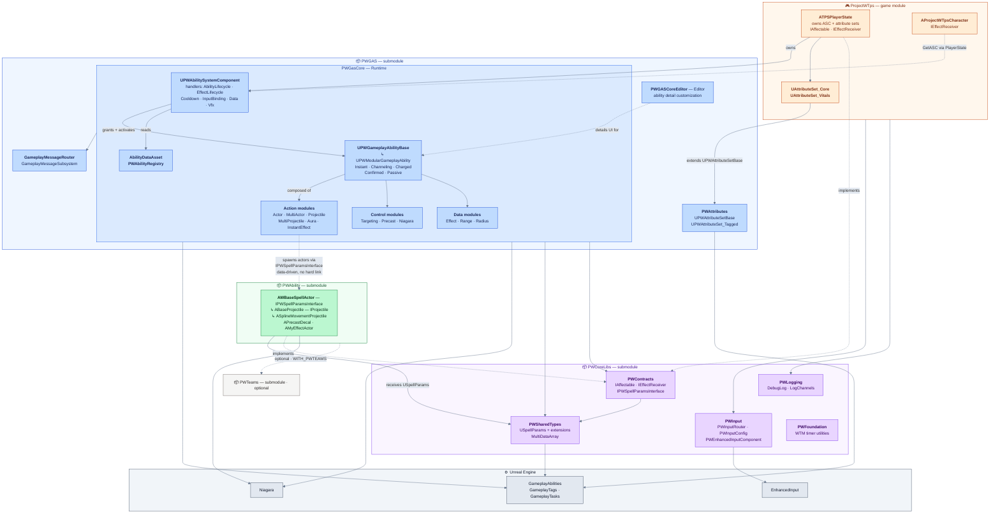
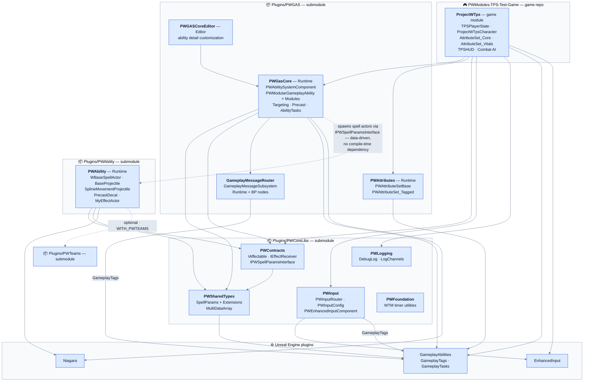
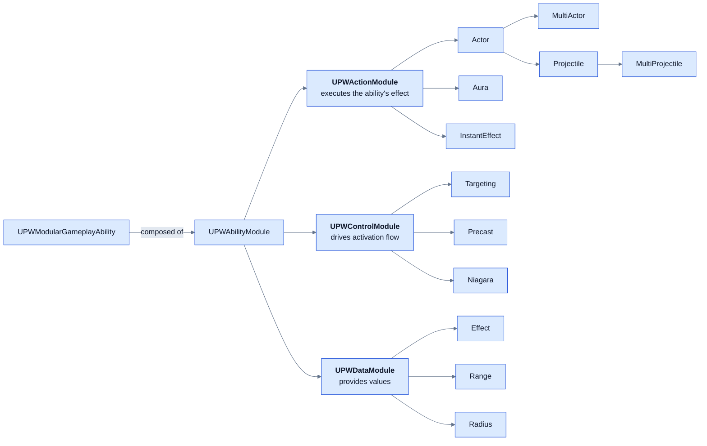

# GAS Structure — ProjectWTps & PW Modules

Architecture overview of the Gameplay Ability System (GAS) stack in this project, spanning the game module and the git submodules **PWGAS**, **PWAbility**, and **PWCoreLibs** (plus the optional **PWTeams**).

> Submodule paths: `Plugins/PWGAS`, `Plugins/PWAbility`, `Plugins/PWCoreLibs`, `Plugins/PWTeams` (see `.gitmodules`).
>
> All diagrams hard-code light fills with dark text (via `%%{init}%%` + `classDef`), so they stay readable in dark-mode renderers.

---

## 1. Everything in one diagram

Full structure in a single view: submodule boundaries, module dependencies (from `*.Build.cs`), the core class wiring, and the modular ability system. Solid arrows are compile-time dependencies/ownership; dashed arrows are interface-based or optional links.

Layering summary:

| Layer | Modules | Role |
|---|---|---|
| Game | `ProjectWTps` | Owns the ASC (on `TPSPlayerState`), concrete attribute sets, characters, AI, UI |
| GAS framework | `PWGasCore`, `PWGASCoreEditor`, `PWAttributes`, `GameplayMessageRouter` | ASC extension, modular ability framework, attribute base classes, decoupled messaging |
| Ability actors | `PWAbility` | Spawnable spell/projectile actors consumed by PWGasCore's action modules |
| Core libs | `PWSharedTypes`, `PWContracts`, `PWInput`, `PWLogging`, `PWFoundation` | Shared types, interfaces (contracts), input routing, logging, utilities |

---

## 2. Module & submodule dependency map

Arrows point from a module to what it depends on (from each `*.Build.cs`). The dashed `PWGasCore → PWAbility` link is the key decoupling: `PWAbilityModule_Actor` spawns any actor class that implements `IPWSpellParamsInterface` (enforced via `MustImplement`), so PWGasCore never links against PWAbility — the actors are wired in through data assets.

---

## 3. Core GAS class diagram

Inheritance, interfaces, and ownership across the modules. `ATPSPlayerState` owns the `UPWAbilitySystemComponent` and both attribute sets; the character resolves the ASC through `IAbilitySystemInterface`.

```mermaid
%%{init: {"theme":"base","themeVariables":{"primaryColor":"#dbeafe","primaryTextColor":"#0f172a","primaryBorderColor":"#1d4ed8","lineColor":"#64748b","textColor":"#1e293b"}}}%%
classDiagram
    direction TB

    %% ── Engine ──
    class UAbilitySystemComponent { <<Engine>> }
    class UGameplayAbility { <<Engine>> }
    class UAttributeSet { <<Engine>> }

    %% ── PWGasCore ──
    class UPWAbilitySystemComponent {
        <<PWGasCore>>
        FPWASC_AbilityLifecycle
        FPWASC_EffectLifecycle
        FPWASC_CooldownHandler
        FPWASC_InputBinding
        FPWASC_DataManagement
        FPWASC_VfxLifecycle
    }
    class UPWGameplayAbilityBase { <<PWGasCore>> }
    class UPWModularGameplayAbility {
        <<PWGasCore>>
        +TArray~UPWAbilityModule~ Modules
    }
    class UPWGameplayAbility_Instant { <<PWGasCore>> }
    class UPWGameplayAbility_Channeling { <<PWGasCore>> }
    class UPWGameplayAbility_Charged { <<PWGasCore>> }
    class UPWGameplayAbility_Confirmed { <<PWGasCore>> }
    class UPWGameplayAbility_Passive { <<PWGasCore>> }
    class UAbilityDataAsset { <<PWGasCore>> }
    class UPWAbilityRegistry { <<PWGasCore>> }

    %% ── PWAttributes ──
    class UPWAttributeSetBase { <<PWAttributes>> }

    %% ── PWCoreLibs ──
    class USpellParams { <<PWSharedTypes>> }
    class USpellParamsExtension { <<PWSharedTypes>> }
    class IAffectable { <<PWContracts>> }
    class IEffectReceiver { <<PWContracts>> }
    class IPWSpellParamsInterface { <<PWContracts>> }

    %% ── PWAbility ──
    class AWBaseSpellActor { <<PWAbility>> }
    class ABaseProjectile { <<PWAbility>> }
    class ASplineMovementProjectile { <<PWAbility>> }
    class IProjectile { <<PWAbility>> }

    %% ── Game ──
    class ATPSPlayerState { <<ProjectWTps>> }
    class AProjectWTpsCharacter { <<ProjectWTps>> }
    class UAttributeSet_Core { <<ProjectWTps>> }
    class UAttributeSet_Vitals { <<ProjectWTps>> }

    %% ASC
    UAbilitySystemComponent <|-- UPWAbilitySystemComponent

    %% Abilities
    UGameplayAbility <|-- UPWGameplayAbilityBase
    UPWGameplayAbilityBase <|-- UPWModularGameplayAbility
    UPWModularGameplayAbility <|-- UPWGameplayAbility_Instant
    UPWModularGameplayAbility <|-- UPWGameplayAbility_Channeling
    UPWModularGameplayAbility <|-- UPWGameplayAbility_Charged
    UPWModularGameplayAbility <|-- UPWGameplayAbility_Confirmed
    UPWModularGameplayAbility <|-- UPWGameplayAbility_Passive

    %% Data
    UPWAbilityRegistry o-- UAbilityDataAsset : registers
    UPWAbilitySystemComponent --> UAbilityDataAsset : grants from

    %% Attributes
    UAttributeSet <|-- UPWAttributeSetBase
    UPWAttributeSetBase <|-- UAttributeSet_Core
    UPWAttributeSetBase <|-- UAttributeSet_Vitals

    %% Game ownership
    ATPSPlayerState *-- UPWAbilitySystemComponent : owns ASC
    ATPSPlayerState *-- UAttributeSet_Core
    ATPSPlayerState *-- UAttributeSet_Vitals
    ATPSPlayerState ..|> IAffectable
    ATPSPlayerState ..|> IEffectReceiver
    AProjectWTpsCharacter ..|> IEffectReceiver
    AProjectWTpsCharacter --> UPWAbilitySystemComponent : GetASC()

    %% Spell actors
    AWBaseSpellActor ..|> IPWSpellParamsInterface
    AWBaseSpellActor <|-- ABaseProjectile
    ABaseProjectile ..|> IProjectile
    ABaseProjectile <|-- ASplineMovementProjectile
    AWBaseSpellActor --> USpellParams : receives
    USpellParams o-- USpellParamsExtension : extensions
```

Also in `PWAttributes`: `UPWAttributeSet_Tagged` (a second `UAttributeSet` base) and an experimental per-attribute-set family (`BasicAttribute` / `ClampedAttribute` / `RegeneratingAttribute`, `AS_Health`, `AS_MovementSpeed`) that is currently commented out.

---

## 4. Modular ability system (PWGasCore)

`UPWModularGameplayAbility` is composed of `UPWAbilityModule` objects in three categories. PWGasCore extends `USpellParamsExtension` (from PWSharedTypes) with Actor/Projectile/Effect extensions to hand spawn data to the spell actors.

Supporting systems in PWGasCore:

- **ASC composition** — `UPWAbilitySystemComponent` delegates to handler classes: `FPWASC_AbilityLifecycle`, `FPWASC_EffectLifecycle`, `FPWASC_CooldownHandler`, `FPWASC_InputBinding`, `FPWASC_DataManagement`, `FPWASC_VfxLifecycle`.
- **Targeting** — `PWTargetPolicyBase` + presetup policies (`CursorSingleTargeting`, `CursorAOETargeting`, `ScreenCenterTargeting`, `SingleTargetResolver`, `SphereTargetResolver`, `ClampRangeFromPawn`).
- **Precast** — `PWPrecastControllerComponent` + visualizers (`CircleDecalVisualizer`, `ProjectilePathVisualizer`); `PWAbility` supplies the `PrecastDecal` actor.
- **Ability tasks** — `TargetDataUnderMouse`, `AbilityTask_WaitInputEvent`, `AbilityTask_PlayMontageAddTagAndWait`, `PWAbilityTask_TargetFromSource`, cooldown-change async tasks.
- **Effects** — `PWGameplayEffectContext`, `PWExecCalc_Base`, `GASCoreTags`.
